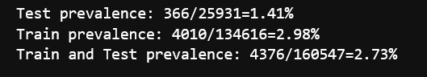

# Exploration of the data for embedding transportability experiences

This journal contains various notes on data exploration.

## 2023-07-14

Satisfying inclusion criteria temporal repartition:


## 2023-07-13

### Sessionization of the visits

1 - Attempt to use the eds-scikit code: it went through quite easily: I saved a table. However, I still don't fully understand their code, and in particular I don't have the impression that they really do sessionalization, which seems to be the right technical solution.

2 - recode only what I need ie. sessionalize all the visits I'm interested in with a groupby.
In doing so, I realize that I'm finding cases where the discharged source is wrong (indicated home when it's not the end of hospitalization). Of the total of 7,055,373 sessions, at least 443,463 are the fusion of at least two visits. The beginning of the distribution of the number of visits per session is as follows:


| n_stays_by_session | count   |
|--------------------|---------|
| 1                  | 6023607 |
| 2                  | 358080  |
| 3                  | 59101   |
| 4                  | 14441   |
| 5                  | 5530    |

I decide to merge the visits into a session, retrieving the information from either the first or the last visit, depending on the type of information. I also concatenate the visit_source_value. The corresponding counts are (maintaining the order):

| visit_source_value                       | count   |
|------------------------------------------|---------|
| hospitalisés hospitalisation incomplète  | 33450   |
| hospitalisation incomplète hospitalisés  | 153527  |
| hospitalisés                             | 4695311 |
| hospitalisation incomplète               | 1584782 |

I lose a lot more stays by refusing to use the stay_id and relying only on the dates of the stay and the dates of the diagnoses.
Before sessionization, I merged the diagnoses to the visits and kept only the visits with at least one diagnosis code. I filtered-out 35,441 patients.
Right now, I keep the visits only if a code occurs between visit_start and visit_end. I filtered-out 124,608 patients.

## 2023-06-19

- I made an error on the study end date. Based on the MACE event occurrence, it is now 2020-12-31 to fall before the MACE prevalence drop. 

- The MACE prevalence is not the same for the test hospital than for the train hospital:


## 2023-06-15

Exploration of the different choices of index visits for the MACE cohort. It seems that choosing later visits yield less MACE codes (first eligible visit, then random and last selected). The more delayed inclusion visit I am choosing the less MACE prevalence I get.
On one hand, if I delay the inclusion visit, I get more and more stays in demonimator, since less index stays are discarded as having a MACE code (first=22296, random=20720, last=18974). It is as if the MACE events disappear progressively.
In the same time, there is less and less MACE events in the followup periods: 14670, 10036, 4031. Why ? 

One explanation is given by plotting all MACE codes in the data for the eligible population. We clearly see that there is a stable regime only between early 2018 and the first quarter of 2021. This in favor of limiting the study between 2018-01-01 and 2021-12-31. The recrudescence during 2018-2019 year is strange though.


The inclusion seems ok: visit table should be complete, at least adter 2018 and up to 2021.


The downward trend is less clear when looking at all patients in the cohort: 


Even when restricting to the 2018/2022 study period, I get more than two times more MACE events for random index (7688) than for last index (3381). 
I'll keep on with random.

## 2023-06-14

- Explorer différent choix de la courbe roc pour mieux comprendre ce que signifie les performances du modèle en terme de détection.
- Correction sur les targets : supression des outcomes avant l'inclusion.

- Premiers résultats cf issue

- Proposition de target (autre complication?): [mortalité à 30 jours post-IDM](https://www.has-sante.fr/upload/docs/application/pdf/2023-04/rapport_idmdc30_retour_dossiers_2023.pdf). La HAS donne 4.5% prévalence dans la population cible.


## 2023-06-12

- Finish the adapation to big data of MACE: I get back the final person (400K rows) and event tables (13.8M rows) with a collect()
- However sinking_parquet does not work at the end with a strange rust error. It might be inersting to cut the computational graph at some point: 

```python
person.sink_parquet(str(path2person))
      3 event.sink_parquet(str(path2event))

File ~/.user_conda/miniconda/envs/py310_matthieu/lib/python3.10/site-packages/polars/lazyframe/frame.py:1595, in LazyFrame.sink_parquet(self, path, compression, compression_level, statistics, row_group_size, data_pagesize_limit, maintain_order, type_coercion, predicate_pushdown, projection_pushdown, simplify_expression, no_optimization, slice_pushdown)
   1584     slice_pushdown = False
   1586 lf = self._ldf.optimization_toggle(
   1587     type_coercion,
   1588     predicate_pushdown,
   (...)
   1593     streaming=True,
   1594 )
-> 1595 return lf.sink_parquet(
   1596     path=path,
   1597     compression=compression,
   1598     compression_level=compression_level,
   1599     statistics=statistics,
   1600     row_group_size=row_group_size,
   1601     data_pagesize_limit=data_pagesize_limit,
   1602     maintain_order=maintain_order,
   1603 )

PanicException: called `Option::unwrap()` on a `None` value
```


## 2023-06-08

- 4 hours to understand that polars with hdfs is shacky. 
- Then minor corrections to the selection procedures to avoid OOM (bad collect timing for example)
- birth_datetime=NaT in all the control cohort. Need to reconstruct from the visit occurrences.


## 2023-04-10

- Check the nabm 2 loinc mapping with susana/ANS mappings. More matches with the susana (84%) / ANS (78%) on the 757 nabm codes in the snds embeddings. Nextstep is mapping the APHP codes from anabio to loinc to nabm and throw away all codes that do not have a mathch. An arbitrary choice has been made to map to a unique nabm the 3600 loinc codes that have multiple nabm codes.  


## 2023-04-08

- 7 days surely is not adpated for the delta decay for the prognosis task. The distribution of delta between the target visit and the first visit of inclusion has the following quantiles: q=[0.1, 0.25, 0.5, 0.75, 0.9] for  the following. This indicates than the order of magnitude is closer to 100 days than 10 days.  

| 0.1 | 0.25 | 0.5 | 0.75 | 0.9 |
|-----|------|-----|------|-----|
| 10.0 | 49.0  | 225.0 | 646..0  | 1090 |

Distribution of these delta between the target visit and the first visit of inclusion


## 2023-04-06

- Replication of cooccurrence matrix between hospitals is working well and I got the same clusters than Theo on the diabetes extraction.
- Description of chapters statistics for our 14K patients with at least 2 visits: 

|            |   Factors influencing health status and contact with health services |   Endocrine, nutritional and metabolic diseases |   Diseases of the circulatory system |   Symptoms, signs and abnormal clinical and laboratory findings, not elsewhere classified |   Neoplasms |   Mental, Behavioral and Neurodevelopmental disorders |   Diseases of the nervous system |   Diseases of the digestive system |   Diseases of the genitourinary system |   Diseases of the musculoskeletal system and connective tissue |   Diseases of the respiratory system |   Injury, poisoning and certain other consequences of external causes |   Diseases of the blood and blood-forming organs and certain disorders involving the immune mechanism |   Certain infectious and parasitic diseases |   Diseases of the eye and adnexa |   External causes of morbidity |   Diseases of the skin and subcutaneous tissue |   Pregnancy, childbirth and the puerperium |   Codes for special purposes |   Congenital malformations, deformations and chromosomal abnormalities |   Diseases of the ear and mastoid process |
|:-----------|---------------------------------------------------------------------:|------------------------------------------------:|-------------------------------------:|------------------------------------------------------------------------------------------:|------------:|------------------------------------------------------:|---------------------------------:|-----------------------------------:|---------------------------------------:|---------------------------------------------------------------:|-------------------------------------:|----------------------------------------------------------------------:|------------------------------------------------------------------------------------------------------:|--------------------------------------------:|---------------------------------:|-------------------------------:|-----------------------------------------------:|-------------------------------------------:|-----------------------------:|-----------------------------------------------------------------------:|------------------------------------------:|
| prevalence |                                                              52.9304 |                                         28.1112 |                              27.9919 |                                                                                   26.7214 |     16.5087 |                                               16.2561 |                          15.3366 |                            15.2453 |                                14.3328 |                                                         14.024 |                               11.441 |                                                               10.8444 |                                                                                                9.7424 |                                      8.5983 |                           6.6049 |                        4.75188 |                                        4.62554 |                                    4.40093 |                      4.12718 |                                                                1.49505 |                                   1.15112 |

- Pass the selection on visits w cim10 in the selection function, finish the implementation with icd10_lvl=1. Added n_coded_visits and target_visit_ix to the target dataframe.
- Try refacto with eds_scikit.phenotype Phenotype class : but when reading the documentation, it does not seems mature enough, since the criteria are only code based. Adding [an issue for generalization of the inclusion criteria]().
- updating eds_scikit to 0.1.5 : changes in the HiveData class that create a little more overhead when using `HiveData.__get_attr__(table_name)` on koalas. Not possible anymore to use `.__get_attribute__`. It seems to do some operation but not clear since it does not collect the data either. Seems like he is caching the first rows. Maybe ask Vincent to look into the issue. 

## 2023-04-05

- Implementing the chapter mapping for cim10_lvl_1: I got 16K patients that respect the criteria. How is it possible that I have more patients than the 13K patients with at least 2 visits ? I have to check this.

## 2023-04-04

Two criteria to define prognosis task: cim10 level (only signifcant at 2 digits) a,n dmin_prevalence. I mimic the Behrt paper for prevalence with min_prevalence=0.01.
What level of cim10 hiearchy should I use ? If I keep fix the min_prevalence, the number of codes does not vary that much for the 13662 patients selected:
- For 2 digits: 98  codes, 10558 patients
- For 3 digits: 74 codes, 8577 patients
- For 4 digits: 67 codes, 8003 patients 

Question: Do I restain only on target ? or also on the previous codes. (I would say target only).

## 2023-04-03

### Exploration of number of patients with at least two hospitalizations

Do I have sufficient patients with at least 2 stays ? 

- I have 19K patients with at least two visit_occurrences and appropriate basic selection criteria. When restringing to patient with at least two visits with cim10, it drops to 13662 patients (and less than 7 visits w coded events). Then I randomly sample a target visit for each patient in his visits. 


### Detail of the Behrt task:

Better predictive task: A lot of previous works do not look at rehospitalization or mortality but at billing code prognosis. Example of such papers are :
- [Behrt, 2020](https://www.nature.com/articles/s41598-020-62922-y). The goal is to predict next diagnosis for GP visits (1.6M patients with at least 5 visits). They evaluate with Average Precision Score and AUROC, weighting the results in the figure by occurence ratio. Three horizon (tasks) : next visit (T1), 6 month, 12 months. For the next visit task (T1), they have 699K patients. For each patient, they select randomly one visit that is above index 3 in the order of visits and they predict for j+1. They group the CIM10 codes into 301 codes thanks to [caliber harmonization](https://rdrr.io/github/rmgpanw/codemapper/f/vignettes/caliber.Rmd). This seems needed because of the mixture of read2, read3 and ICD10 vocabularies. Following the Drees Behrt experiment on the SNDS, I will group into ICD10:2d codes (~200 unique codes) and ICD10:3d codes (~1K codes), the former being for interpretability and the later to compare to Drees performances.
NB every group appearing less than 1% is discarded from the target. They show that position and age embeddings imrove the disease-only baseline, respectively from in total (0.7 AUROC /7.5 APS). 

- TODO: 

## 2023-03-29

- Adapt the report code to ouptut lineplots instead of boxplot
- Save and include a better figure to the simpa presentation for drees prez.

## 2023-03-28

**Launching a full expe with baseline comparison and fine grained**

**What is the correlation between number of events/cim10 and LOS ?**. The hypothesis is that it is a dumb extrapolation task because a direct link can be made between number of event and LOS. It is not so clear when doing the analysis with a poor pearson correlation coefficient : 


[notebook on APHP](/scripts/notebooks/1_explore_covariates.ipynb)

## 2023-03-23

**Build static features**: the datetime used in the visit_occurrences are falsely all set to a night datetime (22 or 23pm). Do not rely on this for features

**Exploring the 8000K persons included with empty information**. Included in the cohort construction but finally excluded because they do not have any events in the database. They sometimes have measurements (1400/8K), do not have a cost neither a billing codes ("very strange for hospitalized people"). The static information on the stay are similar to the full cohort. 5700 have a note. 
Differences with finally included stays: They are attributed more to female (0.7 compared to 0.55 for finally included stays), they concern more admission sans consultation (0.62 vs. 0.53). They abnormally come from Lariboisière (0.25). This points to services that have not deployed orbis and thus have less information on patients. They are more unité d'hebergement as well in the empty stays. Far less men in the empty visits population and younger people. I am wondering if this is really hospitalizations or consultations incorrectly labelled as hospitalization. 
[url to analysis notebook on aphp jupyter](/scripts/notebooks/0.1_explore_qualified_stays_wo_events.ipynb)

**Exploring length of stay extrapolation** as a new task to iterate over the model and have more convincing results.
I restrict to complete hospitalization and a binary task: is the stay shorter/longer than 7 days, considering all information of the stay. The task could be improved by considering only billing codes for the first day.
I calibrate the los task on my previous cohort (rehospitalization complete or not at 30 days): Got the following distribution for the los.


Restricting on the hospitalized, we see that 30% are hospitalized less than 1 day, and 22% more than 7 days. I keep the 7 days threshold since it is often mentionned in the literature (especially for critical cares). 

Could compare to the definition of bed blockers for [Soins Médicaux de Réadaptation from ARS IDF](https://www.sciencedirect.com/science/article/abs/pii/S039876202300069X) defined as mean + sd (in coherent nosological groups) which would give 16 days here if the goal is to detect blockers. Instead the rational would rather be to detect long vs short stays for middle-term plannification and resource allocations.

|                |   count |    mean |     std |   min |   10% |   25% |   33% |   50% |   66% |   75% |   90% |   95% |   max |
|:---------------|--------:|--------:|--------:|------:|------:|------:|------:|------:|------:|------:|------:|------:|------:|
| length_of_stay |   21558 | 5.81478 | 10.5749 |     0 |     1 |     1 |     2 |     3 |     5 |     7 |    13 |    20 |   369 | 

NOTE: Incomplete hospitalizations seems to have more buggy los. It is due to the fact that irradations, dialysis or seances are let open as long as the patient is coming. 

## 2023-03-10

- [ ] Consider using a differen task than rehospitalizaiton since it seems a super
  hard task (ref to beaulieujones risk stratification article with 0.67 of perf
  max). Loss or mortlaity
- Adding the two part of history into the features yields memory blow on the
  project (>16Go).
- If I take an horizon of 7 days, I have 45K patients (less with event of
  course) and a prevalence of 3.46%.

## 2023-03-08

- https://gitlab.inria.fr/soda/matthieu_doutreligne/-/issues/156

## 2023-03-07

### New experience with sample_weights=balanced, demographics and SVD added for SNDS embeddings and Count Event

- The task is too hard. But interstingly, the snds embeddings seems to be good
  even for small sample size. However, not better than in-sample embeddings. The
  method is not bad but not a lot of interest to have the embeddings from
  elsewhere.  


## 2023-03-05
  - intersection with SNDS is 4416 out of 4923 on my population at 30 days
  - [x] Launched vector embeddings for anti cohort
  - Try with measurement but got memory error, so reverse to no measurement.
  - Performances are quite mediocre for all models. Is the task too hard ?
    - Maybe look at 7 days rehospital
    - Maybe diminish the vector size because high sparsity for embeddings when
      computing from train set using d=50 (90%), d=100 (93%), d=150 (97%). Compared
      to SNDS where sparsity is 0%.

  - Why all models do have random performances ? not aligned identifiers
  - Should save a model dictionnary to be able to reload : no I can use joblib
    to dump and load model
  - I still have to create a from_pretrained method to load from external
    sources such as snds.

## 2023-03-03
  - Finish the Event2vecFeaturizer, tested on data

## 2023-03-02

- I have an issue with the coocurrence that shows negative values as if
  substraying by event count is too much : SOLVED, it was an inconsistent sort.groupby.
- Rewrite build_cooc to use sparse matrix.
- Finish coding the experience: run on rehospitalization, but all models have a
  roc at 0.50 as if nothing is learnable. I have to check that the train_score
  are not random and that the labels and features are well aligned.
- Finish coding the one_hot function trhoguh get_event_aggreation
- test the event cohort creation with the real data: pb of memory overflow on
  spark. A quick fix is to increase the spark.driver.memory up to 8g on my database.
- Loss of patients wo events : I lose 11K patients with the criteria to avoid
  patients without any event (in drug administration, condition or occurrence).
  Curiously, a lot of patients marked as hospitalized do not have any codes in
  the cim10 (36K out of 44K selected only have a code in CIM10). So I suppose
  that, when I restrict on dates (inclusion start - start of followup), I lose
  another 3k.
- Applying one_hot_encoding on my cohort of 33K patients, 1M events and 4858
  codes appearing at least 10 times, 10 sec and 5g of
  memory, sparsity is uuuuuuuultra high with 99.8% of sparsity.

## 2023-03-01

- The mapping will be hard to do between snds and aphp biology concepts : is
  there a nabm2loinc ? First, don't do biology ?
- Begin to extract features:
  -  drug_exposure_administration: no missing start datetime, no missing atc code
  -  condition_occurrence: no missing start datetime, nor missing cim10 code
  -  procedure_occurrence: no missing datetime, no missing procedure_source_value
  -  measurement: no missing datetime, no missing measurement_source_value,
- **Decision on missing followup:** on the 806 wo end_datetime_visit, only 10 are
  deceased. So either, death is missing, either this is due to a loss of data in
  the datalake pipeline. I try to get back the end from rss from
  visit_end_datetime. And if I don't succeed I throw away the visit. See
  `get_datetime_from_visit_detail` for precisions.
- **Decision on target**: Use a binary task by default with death or
  rehospitalization. See `coalesce_outcomes` function for precisions.

## 2023-02-24

- Analyse the target variation among the hospitals. There is a pretty stable
  range rate among the sufficiently big hospitals around 0.16. THe small
  hospital acts as outliers. I struggle to have a good rpz for this. Maybe a
  categorical boxplot with category being size of hospitals. Then if an hospital
  is an outlier, I label it on the plot. The legend give the full group names.

- Create the targets: there are 806 out of 45601 includede patients that have
  missing start of followup. I have to take a decision. Either exclude them,
  either populate the end of visit with something.
- create a script for experience setup.
- check the inconsistancy between flowchart and script results:  
```
initial 199824
In observation period 2017-01-01 / 2022-06-01 65979, all included in previous
With sufficient horizon (90 days) after admission 63655,  all included in previous.
Strictly less than 7.0 hospitalizations 61925, not at all included in previous
Aged more than 18 47101
```

Flowchart gives 63315 instead of 63655 at the second stage.  Found the error:
introduced when added a new filter on horizon. Fixed


## 2023-02-23

- Go again through cohort creation
- inspect more in details the rampup of the SI (with SAE): not necessary for now
  I think.
- Ameliorate the population selection to take into account an horizon (useful
  for the target) and to provide a flowchart.
- Implemented the create_target function

- Looked into the visit detail table:
  https://gitlab.inria.fr/soda/matthieu_doutreligne/-/issues/150. Take away:
  PASS/MOUV doublons for urgence and consultation externes without any easy information
  advantage from one or the other (care_site id and timestamps explored).


### What is the link between visit_occurrence and visit_details

*Analysis in 0_Population_hospitalizations.ipynb*

- For hospitalization, does one line in visit_occurrence corresponds to one hospitalization ? With multiple ufr associated to each hospitalization, I would be tempted to say yes. However, there is no good way to be sure.
- For hospitalization, are there multiple lines in visit_details (corresponding probably to multiple units) ? Yes, the median is at 4 for both incomplete and complete hospitalizations.
- For consultation externe or urgences, how many lines are they in the
  visit_details table ? 2 exactly: one PASS and one MOUV for each visit. The
  MOUV lines are systematically linked to the PASS line through the
  visit_detail_parent_id column.
  - For the consultation externes, there is no ufr linked to the MOUV lines. To the PASS lines, there are a non-negligeable part of the lines that are linked only at the hospital level (wo characterization of the service : more than 15%).
  - For the urgence, there is a difference in care_site for the two lines (PASS/MOUV), but wo a clear logic appearing to me.

Do we have more time information in one or the other of the doublon PASS/MOUV ? Not at all.
- urgence : 0 non consistent start time between PASS and MOUV, 539 for end time
- consultation externe : 0 non consistent start time between PASS and MOUV, 0 for end time.

#### Description of the data:

- Visit:
Nb lines 1013046,
Nb unique visit_occurence_id 1013046

- Visit detail:
Nb lines 2648877,
Nb unique visit_detail_id 2648877,
Nb unique visit_occurence_id 1012884

There is almost always at least one visit_detail by visit.


## 2023-01-26

First notebook on aphp machines: `notebooks/0_find_hospitalization.ipynb`

We want to create an event dataframe and a static dataframe with the target
value of rehospitalization at 30/90 days.

### How to isolate hospitalization ?

There is two main issues to define the population of interest.

The EDS data warehouse statistical unit is the visit. However, a hospital stay
is made up of different visits in each UM (Unité Médicale) as explained in the [SNDS
documentation](https://documentation-snds.health-data-hub.fr/snds/fiches/concepts_PMSI.html#pmsi-had).

Moreover, the EDS contains hospitalization and external visits (consultations).
For our rehospitalization task, we need to isolate each hospitalization and
merge visits belongs to the same visits.

1. First, to **keep on
I use the `visit_source_value` present in the `visit` table (only 2000K visit_source_value missings):

|                            | visit_source_value |
| :------------------------- | -----------------: |
| consultation externe       |             513506 |
| urgence                    |             234135 |
| hospitalisés               |             170561 |
| hospitalisation incomplète |              92883 |

- Use the [eds-scikit visit
  grouper](https://aphp.github.io/eds-scikit/latest/functionalities/patients-course/visit_merging/#the-merge_visits-function).
  It could link elements in a given hospitalization but it does not
  differentiate between hospitalization and consultations. Not tested yet.


- *dropped alternative* Use the GHM: GHM is a classification (near 2000K codes) used in MCO for
  billing. It is a combination of the billing codes (PMSI and CCAM). There should
  only one GHM per MCO hospitalization and there is no GHM for consultations. A link between ghm and rum/rss can be made trough `cost_even_id`. However there are several ghm for one rss or one rum which should not be the case.


### What is the repartition of selected hospitalization in the hospitals ?

We link care_site_id declared in the `visit_occurrence` table to
fact_relation_ship and care_site. We use the resources of eds-scikit[aphp],
especially the
[care-site-hiearchy](https://aphp.github.io/eds-scikit/latest/datasets/care-site-hierarchy/).


The Information System ramp up seems homogeneous among the hospitals. To be
sure, I should plot the same heatmap per total patients hospitalized in each
hospital or per hospital activity (obtained with sae).


### Cohort creation

Following [OHDSI definition of a
cohort](https://ohdsi.github.io/TheBookOfOhdsi/Cohorts.html), we define :
- A study period: 2017-(2022-06-01). It would be almost better to have from 2018 given the hospitalizations time repartition.
  - study_start=2012, 80830 patients, 236634 hospitalizations
  - study_start=2017, 67970 patients, 161423 hospitalizations
  - study_start=2018, 61063 patients, 135927 hospitalizations

For the following study, I set the study range to [2017-01-01,2022-06-01]


- inclusion criteria: All patients having at least one hospitalization,
  observation period is all before this first hospitalization. Followup is all
  hospitalization events after this first hospitalization.
- exclusion criteria: Patients aged less than 18 before at the first hospitalization.

Input: raw omop database
Output: inclusion criteria with datetime

Quantiles of the number of hospitalizations by patient:
```
0.10     1.0
0.50     1.0
0.75     2.0
0.90     5.0
0.95     7.0
0.99    15.0
```

I limit to the 95 % of hospitalizations.

Number of patients with K hospitalizations during study period

| n_hospitalizations | n_patients |
| -----------------: | ---------: |
|                  1 |      38572 |
|                  2 |      12754 |
|                  3 |       5782 |
|                  4 |       3238 |
|                  5 |       2005 |
|                  6 |       1332 |
|                  7 |        955 |
|                  8 |        768 |
|                  9 |        542 |
|                 10 |        421 |

Keep 63683 patients with at least one and less than 7.0 hospitalizations during the study period [2017-01-01 00:00:00, 2023-06-01 00:00:00]


Then filtering out 15K patients aged less than 18:

Keep 48472 patients:
- observed during the study period [2017-01-01 00:00:00, 2023-06-01 00:00:00]
- with one to 7.0 hospitalizations
- aged under 18

In our target population during this study period, there is not a lot of
patients having several hospitalizations in different hospitals.

| nb of different hospitals | number of patients |
| ------------------------: | -----------------: |
|                         1 |              40743 |
|                         2 |               6665 |
|                         3 |                947 |
|                         4 |                104 |
|                         5 |                 10 |


### Add the target

- The target is defined by the inclusion criteria (first hospitalization start
  datetime) and the followup at horizon (30, 60 days).

input: person, inclusion_criteria
output: person with inclusion_criteria, inclusion_datetime, target_criteria, target_datetime


### Create the cohort

Input:
- omop database
- person with inclusion and target
Output: event(icd10, ccam, labs, ), static (demographic + inclusion criteria +
target criteria)

# 2022-01-01

# Old experiments on the SNDS

Source data : random sample of 949 591 809 events for 3 026 139 patients on 10 years.

Building the co-occurrence matrix took `42min25s` with a vocabulary size of 5389
distinct events.


Sadly, I lost the embeddings either on Drees gitlab, either on an old laptop.

# Experiment on APHP

## The CKF5 cohort

Work with vocabulary of size 6532 seems and 1 million data points, 5 min for the
coocurrence matrix. The SVD takes a lot if time : 12min.

## Omop samples

### Only with cim10

After a bit of workaround to avoid the bottleneck of the spark driver, it works with vocabulary of size 11157 and 1 million data points, 5 min for the
coocurrence matrix. The SVD takes a lot if time : 12min.

### cim10, labs, drugs, procedures

For 15 M events and 10583 distinct codes, a lot of time to build the co-occurrence (1h) but it works. The sparse SVD is
really quick : 1min.

```bash
2023-01-14 15:52:53.454 | INFO     | event2vec.pmiMatrix:build_cooccurrence_matrix:79 - Fit count vectorizer model
2023-01-14 16:16:11.069 | INFO     | event2vec.pmiMatrix:build_cooccurrence_matrix:83 - Vocabulary of length 10583
2023-01-14 16:16:11.071 | INFO     | event2vec.pmiMatrix:build_cooccurrence_matrix:86 - Transform events with count vectorizer model
2023-01-14 16:43:33.328 | INFO     | event2vec.pmiMatrix:build_cooccurrence_matrix:140 - Saving cooccurrence matrix as parquet at: file:///export/home/cse210038/Matthieu/event2vec/event2vec/../data/results/omop_sample_4tables/spark_matrix.parquet
2023-01-14 16:47:44.763 | INFO     | event2vec.pmiMatrix:build_cooccurrence_matrix:161 - Saving coocurrence_matrix, event_count and vocabulary at /export/home/cse210038/Matthieu/event2vec/event2vec/../data/results/omop_sample_4tables
2023-01-14 16:47:46.069 | INFO     | event2vec.pmiMatrix:event2vec:302 - Shape of the co-occurrence matrix: (10583, 10583)
2023-01-14 16:47:46.070 | INFO     | event2vec.pmiMatrix:event2vec:305 - Build PPMI with smoothing factor 0.75 and shift 1
/export/home/cse210038/Matthieu/event2vec/event2vec/pmiMatrix.py:213: RuntimeWarning: divide by zero encountered in log
  cooccurrence_ratio * np.outer(inverse_item_ratio, inverse_item_ratio)
2023-01-14 16:47:48.294 | INFO     | event2vec.pmiMatrix:event2vec:313 - PPMI factorization with SVD
2023-01-14 16:48:41.109 | INFO     | event2vec.pmiMatrix:event2vec:319 - Embeddings of dimension 100 created from the co-occurrence matrix in 0:00:55.040447
2023-01-14 16:48:41.111 | INFO     | event2vec.pmiMatrix:event2vec:326 - Saving embeddings dictionnary at /export/home/cse210038/Matthieu/event2vec/event2vec/../data/results/omop_sample_4tables/tuto_snds2vec_alpha=0.75_k=1_d=100.json
```
